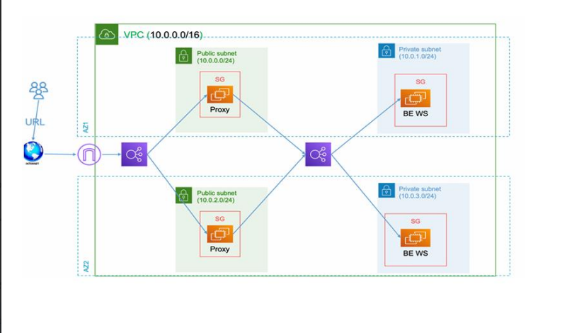

# ☁️ Secure Web App with Public Proxy + Private Backend on AWS using Terraform

This project builds a **secure AWS environment** using **Terraform** with:
- **Public reverse proxies (Nginx)** in public subnets  
- **Private backend servers** (Flask / Node.js app) in private subnets  
- **ALBs**, **NAT Gateway**, and **secure networking**
- **Remote Terraform backend** using S3 + DynamoDB for state management

---

## 🏗️ Architecture Overview



### Components
| Layer | AWS Resource | Description |
|-------|---------------|--------------|
| Network | VPC, Subnets, Route Tables | 2 Public + 2 Private subnets |
| Security | Security Groups, NACLs | Fine-grained ingress/egress rules |
| Compute | EC2 (Nginx Reverse Proxy & Web Backend) | Public EC2s act as proxies; Private EC2s host app |
| Load Balancers | ALB (Public + Internal) | Public → Proxy; Internal → Backend |
| Gateways | NAT Gateway, IGW | Internet & outbound traffic handling |
| State | S3 + DynamoDB | Remote Terraform backend with locking |

---

## 🧰 Folder Structure

```
├── modules
│   ├── vpc
│   │   ├── main.tf
│   │   ├── variables.tf
│   │   └── outputs.tf
│   ├── alb
│   │   ├── main.tf
│   │   ├── variables.tf
│   │   └── outputs.tf
│   ├── ec2
|   |   ├── main.tf
│   │   ├── variables.tf
│   │   └── outputs.tf
│   ├── sg
|   |   ├── main.tf
│   │   ├── variables.tf
│   │   └── outputs.tf
│   ├── subnets
|   |   ├── main.tf
│   │   ├── variables.tf
│   │   └── outputs.tf
├── scripts
|   ├── installing_backend.sh
│   └── installing_proxy.sh
├── provider.tf
├── main.tf
├── backend.tf
├──
├── variables.tf
├── outputs.tf
└── README.md
```

---

## ⚙️ Setup Instructions

### 1️⃣ Prerequisites

- AWS account with IAM user + Access Keys
- Terraform v1.5+  
- SSH key pair created and available locally (`~/.ssh/id_rsa`)
- (Optional) AWS CLI installed for validation

---

### 2️⃣ Deploy the Remote Backend (S3 + DynamoDB)

```bash
terraform init
terraform apply 
```

This creates:
- **S3 Bucket:** `state-bucket`
- **DynamoDB Table:** `terraform-lock`

---

### 3️⃣ Configure Backend in Main Infrastructure

Edit `main-infra/backend.tf`:
```hcl
terraform {
  backend "s3" {
    bucket         = "state-bucket"
    region         = "us-east-1"
    dynamodb_table = "terraform-lock"
    encrypt        = true
  }
}
```

---

### 4️⃣ Initialize Workspace

```bash
terraform init -reconfigure
terraform workspace new dev
terraform workspace select dev
```

---

### 5️⃣ Deploy Infrastructure

```bash
terraform plan
terraform apply 
```

Terraform will:
- Create VPC, subnets, routing, and security groups  
- Launch EC2s (Proxy + Backend)  
- Configure ALBs  
- Setup NAT and Internet Gateways  
- Use provisioners to install Nginx/Apache  

---

## 🧩 Provisioners Summary

Example output file:
```
public-ip1 3.120.55.10
public-ip2 18.213.45.89
private-ip1 10.0.1.22
private-ip2 10.0.2.15
```

---


## 🧾 Outputs

After deployment, Terraform prints:
```
alb_public_dns = "http://myapp-alb-123456.elb.amazonaws.com"
backend_private_ips = ["10.0.1.22", "10.0.2.15"]
proxy_public_ips = ["3.120.55.10", "18.213.45.89"]
```

---

## 🧹 Clean Up

When done:
```bash
terraform destroy 
```

---

